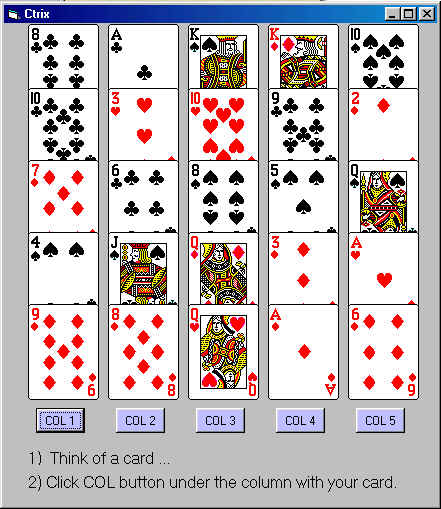



## An old card\-trick

### Description

"ctrix" is an old card-trick using VBCARDS.OCX (included). It has a good shuffle routine you can cut/paste into your own card apps. Not an original idea, but I thought it would be fun to see if I could create it myself. Have Fun!
 
### More Info
 

             |
---                |---
**Submitted On**   |2000-08-01 07:34:36
**By**             |[Max Seim](https://github.com/Planet-Source-Code/PSCIndex/blob/master/ByAuthor/max-seim.md)
**Level**          |Beginner
**User Rating**    |4.5 (18 globes from 4 users)
**Compatibility**  |VB 5\.0, VB 6\.0
**Category**       |[Complete Applications](https://github.com/Planet-Source-Code/PSCIndex/blob/master/ByCategory/complete-applications__1-27.md)
**World**          |[Visual Basic](https://github.com/Planet-Source-Code/PSCIndex/blob/master/ByWorld/visual-basic.md)
**Archive File**   |[CODE\_UPLOAD8467812000\.zip](https://github.com/Planet-Source-Code/max-seim-an-old-card-trick__1-10249/archive/master.zip)

